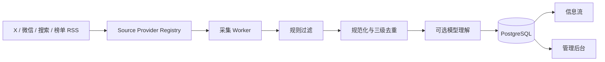

# 见微

**把分散的信息源，变成一条真正值得读的智能信息流。**

统一监控 X / Twitter、微信公众号、全网关键词、榜单和 RSS；自动完成采集、去重、中文摘要、分类、标签与推荐理由。

[快速开始](#快速开始) · [支持的信息源](#支持的信息源) · [它怎样工作](#它怎样工作) · [完整项目手册](docs/project-handbook.md) · [生产部署](docs/production-deploy.md)

> **当前为私有项目。** 仓库暂未提供开源许可证，不授予复制、修改或再分发权。未来开放前会先完成许可证、依赖和敏感信息审计。

---

## 为什么需要见微？

真正麻烦的不是“网上没有信息”，而是信息太散、太杂，也太难持续追踪：

- “帮我持续关注这个 X 博主” → 官方 API 要额度，抓取方式也可能变化。
- “这个公众号更新了什么” → 文章列表、正文获取和登录状态是三件不同的事。
- “全网出现这个品牌的新消息时告诉我” → 搜索结果很多，但真正相关的很少。
- “我只想看 AI 行业内容” → 普通热榜里会混进娱乐、社会和无关消费资讯。
- “英文论文和推文太多” → 标题、摘要和上下文需要统一成中文。
- “为什么这条内容值得看” → 只有标签不够，还需要具体、可解释的推荐理由。

见微把这条链路收进一个产品：

```text
添加账号 / 公众号 / 关键词 / RSS
                ↓
        定时采集与智能错峰
                ↓
        规则过滤、清洗和去重
                ↓
   中文标题、摘要、类型、标签、相关性
                ↓
       一条可搜索、可筛选的信息流
```

## 一分钟看懂

| 你提供什么 | 见微做什么 | 你最后看到什么 |
| --- | --- | --- |
| X 公开账号 | 定时读取原创推文，可选回复、转推和引用 | 中文推文、作者、标签与相关性 |
| 公众号文章链接 | 识别并订阅公众号，持续拉取新文章 | 公众号名称、文章、全文摘要 |
| 公众号关键词 | 在已订阅账号的文章中做本地筛选 | 跨公众号的专题信息流 |
| 全网关键词 | 调用指定搜索服务并应用必含、排除和域名规则 | 更聚焦的网页和新闻结果 |
| 榜单 / RSS | 复用 TrendRadar 采集与来源配置 | 统一格式的榜单和 RSS 内容 |

## 使用前你可能想知道

| 问题 | 答案 |
| --- | --- |
| 数据存在哪里？ | PostgreSQL 和 Docker volumes，默认都在你自己的机器上。 |
| API Key 会显示给前端吗？ | 不会。后台只返回“是否已配置”；密钥使用 `APP_ENCRYPTION_KEY` 加密后保存。 |
| 一定要配置模型吗？ | 不需要。采集可以独立运行；启用模型后才会生成更好的摘要、中文标题、分类和推荐理由。 |
| 会不会所有内容都先花钱调用模型？ | 不会。明显无关的内容先经过规则过滤，模型在入库链路的后段处理。 |
| 第三方采集能永远稳定吗？ | 不能。微信、X、搜索和上游开源项目都可能受登录、额度、风控和接口变化影响。 |
| 能部署到服务器吗？ | 可以。仓库包含 Docker Compose 和 Caddy HTTPS 生产方案。 |
| 现在可以公开仓库吗？ | 暂时不建议。完整开源准备清单在项目手册中。 |

## 支持的信息源

| 信息源 | 当前接入方式 | 需要配置 | 适合场景 |
| --- | --- | --- | --- |
| X / Twitter | SuperGrok / X Search | 完成 xAI 授权 | 不单独购买 X API 时的推荐路径 |
| X / Twitter | X 官方 API | `X_BEARER_TOKEN` | 官方接口后备路径 |
| 微信公众号 | WeRSS | 扫码登录 + Access Key | 订阅指定公众号 |
| 公众号关键词 | 本地规则 | 先订阅公众号 | 多个公众号中的专题筛选 |
| 全网搜索 | Brave Search | `BRAVE_SEARCH_API_KEY` | 品牌词、公司名和新闻监控 |
| 全网搜索 | Tavily | `TAVILY_API_KEY` | 语义研究和宽召回 |
| 全网搜索 | Serper | `SERPER_API_KEY` | Google 结果面 |
| 榜单 / RSS | TrendRadar Sidecar | 后台选择来源 | 国内榜单、新闻站和 RSS |
| 公众号全文备用 | wechat-download-api 兼容服务 | 可选的第二次扫码 | WeRSS 没有正文时的增强通道 |

> 不知道选哪个？X 默认优先 SuperGrok；全网搜索默认优先 Brave；微信公众号先只配置 WeRSS，遇到缺失全文时再启用备用采集器。

## 快速开始

需要提前安装：

- Docker Desktop 或 OrbStack。
- Git。

克隆私有仓库并启动：

```bash
git clone https://github.com/skymao2021/jianwei.git
cd jianwei
./start.sh
```

`start.sh` 首次运行会：

1. 复制 `.env.example` 为 `.env`。
2. 自动生成后台初始密码、API Token 和加密密钥。
3. 检查 Docker 与 Compose 配置。
4. 构建并启动数据库、Web、worker、WeRSS 和 TrendRadar。
5. 提示仍未配置的平台凭据。

启动后访问：

| 页面 | 地址 | 用途 |
| --- | --- | --- |
| 信息流 | <http://localhost:3000> | 阅读精选、最新和全部信息 |
| 监控任务 | <http://localhost:3000/admin> | 添加账号、公众号和关键词 |
| 平台连接 | <http://localhost:3000/admin/connectors> | 配置 API、模型、RSS 和全文通道 |
| WeRSS 后台 | <http://localhost:8001> | 微信扫码和公众号订阅状态 |
| TrendRadar | <http://localhost:8088> | 查看上游榜单和 RSS 采集结果 |

### 第一次配置

1. 从 `.env` 查看自动生成的 `ADMIN_USERNAME` 和 `ADMIN_PASSWORD`。
2. 登录 `/admin`；登录后可在后台修改成容易记忆的密码。
3. 打开“平台连接”，只配置你准备使用的信息源。
4. 使用公众号时，在 WeRSS 后台完成扫码。
5. 在“监控任务”中添加一个来源。
6. 可以先预览，也可以直接添加，让后台完成首次识别。

> 真实 `.env`、API Key、数据库和登录状态不会进入 Git。不要把 `.env` 内容粘贴到 Issue、截图或公开日志中。

## 添加监控

### X / Twitter

填写公开账号用户名，选择采集方式和内容范围：

- 默认只采集原创内容。
- 回复、转推和引用需要分别开启。
- 使用 SuperGrok 时建议每 2–3 小时采集一次。
- 使用官方 API 时可根据额度调整到 30–60 分钟。

### 微信公众号

粘贴该公众号任意一篇公开文章链接。见微会在后台完成：

1. 识别公众号。
2. 向 WeRSS 写入订阅。
3. 保存公众号名称和标识。
4. 按频率采集新文章。
5. 根据全文状态决定是否进入模型理解。

公众号通常不需要分钟级轮询，建议每 2–3 小时一次。

### 公众号关键词

这是对已入库文章的本地筛选，不会重新请求微信：

- 搜索关键词：描述主题。
- 必含词：多个词需要全部命中。
- 排除词：压掉明显歧义。
- 目标公众号：可以限定范围。

本地筛选成本较低，建议每 15–30 分钟执行。

### 全网关键词

每个任务固定保存自己的搜索 Provider，不会在多个 API 之间随机切换。

为了减少无关结果，建议至少填写：

- 清晰的搜索关键词。
- 一个品牌、公司或主题必含词。
- 容易产生歧义时填写排除词。
- 必要时限定或排除域名。

全网搜索会消耗 API 额度，品牌舆情可用 1 小时，普通行业追踪建议 2–4 小时。

## 它怎样工作



核心原则：

- **所有来源走同一 Provider 协议**：新增平台不直接污染 worker 主流程。
- **规则先于模型**：明显无关内容不会消耗摘要费用。
- **原始内容与中文展示分离**：英文内容翻译后展示，但保留原始信息。
- **失败不伪装成功**：模型失败、缺少全文、授权失效都会保存独立状态。
- **来源可追溯**：每条内容通过 `item_matches` 记录由哪个任务命中。
- **同频率任务自动错峰**：避免几十个账号在同一分钟冲击第三方服务。

完整架构、数据模型、API 和处理状态见 [《见微项目手册》](docs/project-handbook.md)。

## AI 内容理解

后台“模型 API”是统一内容能力，不只是公众号摘要。启用后可以处理：

- X 推文：忠实转换成自然中文。
- 英文文章：生成中文标题和摘要。
- 微信公众号：在拿到全文后生成内容摘要。
- 全网搜索和 RSS：清理原始片段并统一表达。
- 所有来源：生成内容类型、动态主题标签、相关性分和具体推荐理由。

支持 OpenAI Chat Completions 兼容接口，可接入 DeepSeek、火山方舟和其他兼容服务。填写 Base URL 与 API Key 后，后台可以检测可用模型。

模型失败内容会记录状态并进入小批量重试，不会一次性重跑全部历史内容造成费用失控。

## 采集频率与智能错峰

后台提供三组频率：

| 分组 | 可选频率 |
| --- | --- |
| 高频更新 | 10、15、20、30、45 分钟 |
| 常规监控 | 1、1.5、2、3、4、5、6 小时 |
| 低频巡检 | 8、12、24 小时 |

频率不是越快越好。系统会根据任务生成稳定时间偏移，让同频率账号分散执行；暂时性失败也会错峰重试，避免在恢复时形成请求洪峰。

## Docker 服务

| 服务 | 作用 | 本机端口 |
| --- | --- | --- |
| `web` | 信息流、管理后台和 API | `3000` |
| `worker` | 常驻采集与内容处理 | — |
| `postgres` | 统一数据存储 | `54329` |
| `migrate` | 启动前自动迁移和种子 | — |
| `werss` | 微信公众号订阅 | `8001` |
| `trendradar` | 榜单和 RSS | `8088` |
| `trendradar-mcp` | TrendRadar 查询接口 | `3333` |
| `trendradar-refresh` | 保存来源后立即触发刷新 | — |
| `wechat-fallback` | 可选公众号全文增强 | `5055` |

停止服务但保留数据：

```bash
docker compose down
```

## 常用命令

```bash
./start.sh status     # 查看服务状态
./start.sh doctor     # 检查 Docker、配置和凭据
./start.sh logs       # 查看实时日志
./start.sh restart    # 重启服务
./start.sh stop       # 停止并保留数据
```

开发检查：

```bash
pnpm install
pnpm lint
pnpm test
pnpm build
docker compose config
```

## 部署到服务器

公网部署请使用 `docker-compose.prod.yml`。生产模式只暴露 Caddy 的 80/443，PostgreSQL、WeRSS、TrendRadar 和 MCP 服务全部保留在 Docker 内网。

不要把本地 Compose 的数据库和管理侧车端口直接暴露到公网。

完整步骤、HTTPS、备份和升级方式见 [生产部署说明](docs/production-deploy.md)。

## 安全与数据

- 管理后台使用账号密码登录。
- 程序调用写 API 使用独立 Bearer Token。
- 管理员新密码使用 scrypt 加盐哈希。
- 平台 API Key 使用 AES-256-GCM 加密入库。
- 浏览器只知道凭据是否已配置，不会取回明文。
- `.env`、构建目录、数据库和本地缓存均被 Git 忽略。
- 容器不挂载 Docker Socket。

`APP_ENCRYPTION_KEY` 必须与数据库一起备份。丢失后，数据库中已有的加密凭据无法恢复，只能重新填写。

## 项目文档

| 文档 | 内容 |
| --- | --- |
| [项目手册](docs/project-handbook.md) | 产品、架构、数据链路、API、安全、运维与开源准备 |
| [生产部署](docs/production-deploy.md) | 公网服务器、Caddy、HTTPS、备份与升级 |
| [TrendRadar 集成架构](docs/architecture-trendradar.md) | 为什么复用 Sidecar，以及许可证边界 |
| [第三方声明](THIRD_PARTY_NOTICES.md) | 第三方项目和许可证说明 |
| `docs/plans/` | 历史设计和实施计划，不代表所有内容仍是当前行为 |

## 当前状态

当前私有版本：`v0.1.0`

已经具备完整的单用户自托管闭环，但仍依赖第三方平台和开源采集器。决定开源前，需要完成许可证选择、Git 历史清理、CI、安全审计、公开演示数据和平台合规说明。详细清单见项目手册的“未来开源准备”章节。
