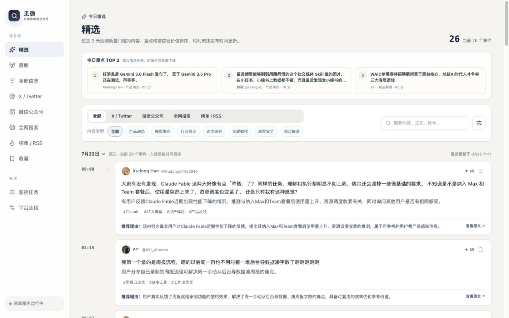
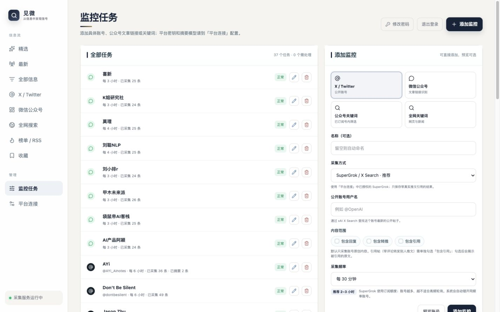
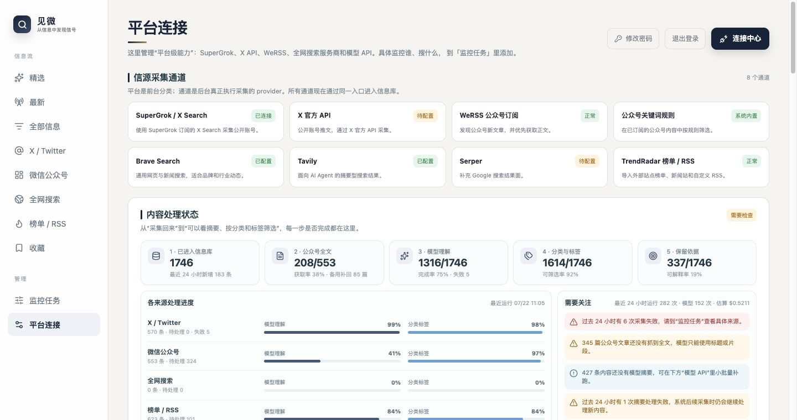
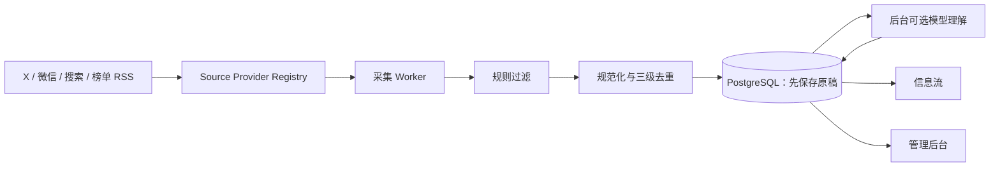

# 见微

[](https://github.com/workagi/jianwei/actions/workflows/ci.yml)
[](LICENSE)

**少刷几个平台，也不错过真正重要的信息。**

把你想长期关注的 X 博主、微信公众号、行业关键词、榜单和 RSS 交给见微。它会持续替你跟踪更新，过滤重复和无关内容，把外文资讯整理成中文，并告诉你每条内容为什么值得看。

每天只需打开一个页面，就能看到真正与你有关的新动态。

[快速开始](#快速开始) · [支持的信息源](#支持的信息源) · [它怎样工作](#它怎样工作) · [完整项目手册](docs/project-handbook.md) · [生产部署](docs/production-deploy.md) · [参与贡献](CONTRIBUTING.md)

> 见微主程序采用 [Apache License 2.0](LICENSE) 开源；第三方采集服务仍适用各自许可证和平台规则。

---

## 界面预览

### 一条统一的信息流



### 在后台添加和管理监控任务



### 查看采集通道与内容处理状态



## 为什么需要见微？

真正麻烦的不是“网上没有信息”，而是信息太散、太杂，也太难持续追踪：

- “帮我持续关注这个 X 博主” → 官方 API 要额度，抓取方式也可能变化。
- “这个公众号更新了什么” → 文章列表、正文获取和登录状态是三件不同的事。
- “全网出现这个品牌的新消息时告诉我” → 搜索结果很多，但真正相关的很少。
- “我只想看 AI 行业内容” → 普通热榜里会混进娱乐、社会和无关消费资讯。
- “英文论文和推文太多” → 标题、摘要和上下文需要统一成中文。
- “为什么这条内容值得看” → 只有标签不够，还需要具体、可解释的推荐理由。

见微把持续追踪、筛选、理解和阅读收进一个产品，不再需要分别维护多套采集脚本和阅读入口。

## 一分钟看懂

| 1. 添加来源 | 2. 系统自动处理 | 3. 阅读与管理 |
| --- | --- | --- |
| 添加 X 账号、公众号文章链接、关键词、榜单或 RSS | 定时采集与智能错峰，先过滤、清洗和去重，再按需调用模型理解内容 | 在一条中文信息流中按平台、类型和主题筛选，查看摘要、标签与推荐理由 |

## 使用前你可能想知道

| 问题 | 答案 |
| --- | --- |
| 数据存在哪里？ | PostgreSQL 和 Docker volumes，默认都在你自己的机器上。 |
| API Key 会显示给前端吗？ | 不会。后台只返回“是否已配置”；密钥使用 `APP_ENCRYPTION_KEY` 加密后保存。 |
| 一定要配置模型吗？ | 不需要。采集可以独立运行；启用模型后才会生成更好的摘要、中文标题、分类和推荐理由。 |
| 会不会所有内容都先花钱调用模型？ | 不会。明显无关的内容先经过规则过滤，原稿先保存，模型理解由后台小批量处理。 |
| 第三方采集能永远稳定吗？ | 不能。微信、X、搜索和上游开源项目都可能受登录、额度、风控和接口变化影响。 |
| 能部署到服务器吗？ | 可以。仓库包含 Docker Compose 和 Caddy HTTPS 生产方案。 |
| 可以自行部署和修改吗？ | 可以。见微主程序采用 Apache-2.0；独立 Sidecar 和上游镜像仍适用各自许可证。 |

## 支持的信息源

| 信息源 | 可选接入方式 | 需要配置 | 适合场景 |
| --- | --- | --- | --- |
| X / Twitter | **首选：** SuperGrok / X Search<br>**后备：** X 官方 API | xAI 授权<br>或 `X_BEARER_TOKEN` | 不单独购买 X API 时使用 SuperGrok；需要官方接口时切换后备通道 |
| 微信公众号 | **默认订阅：** WeRSS<br>**外置备选：** ZLZChat 兼容接口（可选）<br>**专题筛选：** 本地关键词规则<br>**全文增强：** wechat-download-api 兼容服务（可选） | WeRSS 扫码登录 + Access Key<br>或自建 ZLZChat 地址 + API Key<br>关键词筛选需先订阅公众号 | 订阅指定公众号、跨公众号筛选专题；ZLZChat 只作为独立故障域的备选，不与 WeRSS 自动切换 |
| 全网搜索 | **默认：** Brave Search<br>**语义研究：** Tavily<br>**Google 结果：** Serper | `BRAVE_SEARCH_API_KEY`<br>`TAVILY_API_KEY`<br>`SERPER_API_KEY` | 品牌与新闻监控、语义宽召回或 Google 结果采集；每个任务固定使用所选服务 |
| 榜单 / RSS | **榜单：** TrendRadar Sidecar<br>**订阅：** 后台自定义 RSS | 在后台启用榜单来源<br>或填写 RSS 名称和地址 | 国内热门榜单、新闻站和自定义 RSS 订阅 |

> 不知道选哪个？X 默认优先 SuperGrok；全网搜索默认优先 Brave；微信公众号先配置 WeRSS。只有你已经自行部署并维护 ZLZChat 时，才把单个公众号监控切换到 ZLZChat 备选通道。
>
> 同一行里的接入方式是同类信息源的不同路径或增强能力，不会在信息流里被拆成多个平台。
>
> 请只处理你有权访问的信息，并遵守 X、微信、搜索服务和模型服务的使用条款。见微不会绕过平台安全机制，也不承诺非官方通道永久可用。

## 快速开始

### 配置建议

| 部署模式 | CPU | 内存 | 磁盘 | 说明 |
| -------- | --- | ---- | ---- | ---- |
| 核心服务（web + db + worker） | 1 核 | 2 GB | 10 GB | 小规模部署目标；默认模式，不含公众号和热榜采集 |
| + WeRSS（公众号采集） | 2 核 | 3 GB | 15 GB | 含浏览器环境 |
| + TrendRadar（热榜） | 2-3 核 | 4 GB | 20 GB | 含热榜/RSS 采集与 MCP |
| 完整全量部署 | 4 核 | 4 GB+ | 30 GB+ | 以上全部 + 全文回填 |

> 上表是容量规划建议，不是已验证的硬件最低值。隔离的 2,000 篇长文样例中，生产 Web 两个并发阅读请求峰值约从 499 MiB 降到 220 MiB；完整 2 GB 主机、真实采集器峰值和长期运行仍待验证。方法与边界见 [低资源优化记录](docs/low-resource-optimization.md)。

> 如果要同时运行 WeRSS、TrendRadar、全文增强和较高频监控，4GB 是起步值，8GB 更稳。没有 Swap 的 4GB 云主机可以完成小规模冒烟测试，但不建议长期承载大量公众号或全文回填。

WeRSS 当前固定上游包含 x86_64 程序，从 v0.3.1 起只发布 `linux/amd64` 镜像，Compose 明确选择该架构。Apple Silicon 或其他 ARM 主机启用 `wechat` profile 时，需要 Docker 环境支持 amd64 仿真，并承担额外 CPU 和内存开销；不支持仿真的 ARM 服务器可连接外部 amd64 WeRSS，通过 `WERSS_DOCKER_BASE_URL` 指定地址。核心 Web、Worker 和迁移工具仍提供 amd64/arm64 镜像，WeRSS 尚未提供原生 ARM 支持。

### 准备工作

需要提前安装：

- Docker Desktop 或 OrbStack，包含 Docker Compose v2.20.3+。

> **国内服务器部署**：如果 Docker 构建时无法访问 npmjs.org 或 ghcr.io，请使用 `Dockerfile.cn`（内置阿里云 npm 镜像）：
> ```bash
> cp Dockerfile.cn Dockerfile
> ```
> WeRSS 基础镜像若无法从 `ghcr.io` 拉取，可通过南京大学镜像中转：
> ```bash
> docker pull --platform linux/amd64 ghcr.nju.edu.cn/rachelos/we-mp-rss@sha256:af771f21b3f7958a5dea16911fba050a6d7b92eac2fb2499c467c1b11f07ef34
> docker tag ghcr.nju.edu.cn/rachelos/we-mp-rss@sha256:af771f21b3f7958a5dea16911fba050a6d7b92eac2fb2499c467c1b11f07ef34 jianwei-werss-upstream:pinned
> ```
> 然后把 `.env` 中的 `WERSS_UPSTREAM_IMAGE` 改为 `jianwei-werss-upstream:pinned` 再启动。不要改回浮动的 `latest`，否则同一份 Jianwei 代码可能在不同日期构建出不同结果。

- Git。

克隆仓库并启动：

```bash
git clone https://github.com/workagi/jianwei.git
cd jianwei
./start.sh
```

这条路径适合本机、内网或临时测试。公网长期运行请直接使用下面的「部署到服务器」和 [生产部署说明](docs/production-deploy.md)，不要把 HTTP 的 `3000/8001/8088` 端口直接暴露给互联网。

`start.sh` 首次运行会：

1. 复制 `.env.example` 为 `.env`。
2. 写入固定的首次登录密码 `admin@123`，并随机生成只供程序使用的 API Token 和加密密钥。
3. 检查 Docker 与 Compose 配置。
4. 构建并启动数据库、Web 和 worker，自动运行一次迁移与种子初始化。
5. 提示仍未配置的平台凭据。

启动后访问：

| 页面 | 地址 | 用途 |
| --- | --- | --- |
| 信息流 | <http://localhost:3000> | 阅读关注变化、精选、最新和全部信息 |
| 监控任务 | <http://localhost:3000/admin> | 添加账号、公众号和关键词 |
| 平台连接 | <http://localhost:3000/admin/connectors> | 配置 API、模型、RSS 和全文通道 |
| WeRSS 后台（启用后） | <http://localhost:8001> | 微信扫码、公众号订阅、创建 Access Key |
| TrendRadar（启用后） | <http://localhost:8088> | 调试用（数据通过主站 3000 端口访问） |

需要公众号时，在 `.env` 设置 `COMPOSE_PROFILES=wechat`；需要榜单/RSS 时设置 `COMPOSE_PROFILES=trendradar`；同时需要则使用 `COMPOSE_PROFILES=wechat,trendradar`，然后再次运行 `./start.sh`。不需要的采集器不会常驻，也不会在新库生成默认热榜监控。升级旧库会保留已有监控；关闭采集器时，先在后台停用对应监控或配置外部服务，再用原 profile 停止对应容器，最后移除 profile。

预构建镜像部署入口已加入：将 `.env` 的 `JIANWEI_IMAGE_TAG` 设置为实际已发布的版本标签后，`./start.sh` 会拉取镜像并跳过本机编译。留空仍从源码构建。版本镜像从 `v0.3.0` 开始由 Release 工作流发布；`v0.2.0` 不提供这些镜像。确认对应发布完成及镜像可拉取后再填写标签；GHCR 访问设置见 [版本发布](docs/release-process.md)。

### 默认凭据

> **⚠️ 安全提醒：首次登录后请立即修改密码！**

见微管理后台与 WeRSS（公众号采集器）使用统一的默认凭据：

| 服务 | 地址 | 账号 | 密码 |
| ---- | ---- | ---- | ---- |
| 见微后台 | `http://localhost:3000/admin` | `admin` | `admin@123` |
| WeRSS 后台 | `http://localhost:8001` | `admin` | `admin@123` |

`start.sh` 首次运行会自动将密码写入 `.env` 的 `ADMIN_PASSWORD`。登录后请在后台修改为强密码。

### 新手上路（5 分钟搞定第一个监控）

第一次打开见微，信息流是空的。别急，按下面步骤来：

**第 1 步：打开后台**  
浏览器访问 http://localhost:3000/admin ，用 admin / admin@123 登录。  
登录后点右上角修改密码，换成自己的。

**第 2 步：配好你要用的信息源**  
左侧菜单点「平台连接」。你想关注什么，就配什么：

| 我想关注… | 需要配什么 | 怎么配 |
| --------- | ---------- | ------ |
| 微信公众号 | WeRSS | 先启用 `wechat` profile，再打开 http://localhost:8001 → admin / admin@123 登录 → 扫码绑定微信 → 创建 Access Key → 把 AK:SK 填到 .env 的 WERSS_ACCESS_KEY= 后面 |
| X（Twitter）博主 | SuperGrok（默认） | 在「平台连接」点击「连接 SuperGrok」完成 xAI 授权；不需要手填 X API Key |
| 全网关键词搜索 | Brave Search API | 去 brave.com 申请免费 API Key，填到「平台连接」→ Brave Search |
| 国内热榜、RSS | TrendRadar | 先启用 `trendradar` profile，再在平台连接中选择榜单或添加 RSS |

> 不需要全部配完。比如今天只想看公众号，配好 WeRSS 就够了。后面想加 X 博主时再来配也来得及。

**第 3 步：添加你要监控的内容**  
左侧菜单点「监控任务」→「添加监控」：

- 想关注某个公众号 → 选「微信公众号」，粘贴任意一篇文章链接
- 想关注某个 X 博主 → 选「X 账号」，填用户名
- 想追踪某个关键词 → 选「关键词搜索」，填搜索词
- 想看热榜 → 选「榜单 / RSS」

填好名称，点「添加」。系统会自动开始定时采集。

**第 4 步：等着看结果**  
添加后 1-2 分钟，刷新首页 http://localhost:3000 ，第一条内容就出现了。每条内容会标注「为什么值得看」——是命中了你的关键词，还是 AI 判断它有信息量。

> 不熟悉面板？左侧三个菜单：「信息流」看结果、「监控任务」管理关注、「平台连接」配 API/公众号。大部分时间你只需要前两个。

> 真实 .env、API Key、数据库和登录状态不会进入 Git。不要把 .env 内容粘贴到 Issue、截图或公开日志中。

## 添加监控

### X / Twitter

填写公开账号用户名，选择采集方式和内容范围：

- 默认只采集原创内容。
- 回复、转推和引用需要分别开启。
- 使用 SuperGrok 时建议每 2–3 小时采集一次。
- 使用官方 API 时可根据额度调整到 30–60 分钟。

### 微信公众号

粘贴该公众号任意一篇公开文章链接。见微会在后台完成：

1. 识别公众号。
2. 向 WeRSS 写入订阅。
3. 保存公众号名称和标识。
4. 按频率采集新文章。
5. 根据全文状态决定是否进入模型理解。

公众号通常不需要分钟级轮询，建议每 2–3 小时一次。

### 公众号关键词

这是对已入库文章的本地筛选，不会重新请求微信：

- 搜索关键词：描述主题。
- 必含词：多个词需要全部命中。
- 排除词：压掉明显歧义。
- 目标公众号：可以限定范围。

本地筛选成本较低，建议每 15–30 分钟执行。

### 全网关键词

每个任务固定保存自己的搜索 Provider，不会在多个 API 之间随机切换。

为了减少无关结果，建议至少填写：

- 清晰的搜索关键词。
- 一个品牌、公司或主题必含词。
- 容易产生歧义时填写排除词。
- 必要时限定或排除域名。

全网搜索会消耗 API 额度，品牌舆情可用 1 小时，普通行业追踪建议 2–4 小时。

## 它怎样工作


```mermaid
flowchart LR
    Sources["X / 微信 / 搜索 / 榜单 RSS"] --> Provider["Source Provider Registry"]
    Provider --> Worker["采集 Worker"]
    Worker --> Rules["规则过滤"]
    Rules --> Dedupe["规范化与三级去重"]
    Dedupe --> DB[("PostgreSQL：先保存原稿")]
    DB --> Model["后台可选模型理解"]
    Model --> DB
    DB --> Reader["信息流"]
    DB --> Admin["管理后台"]
```

核心原则：

- **所有来源走同一 Provider 协议**：新增平台不直接污染 worker 主流程。
- **规则先于模型**：明显无关内容不会消耗摘要费用。
- **原始内容与中文展示分离**：英文内容翻译后展示，但保留原始信息。
- **失败不伪装成功**：模型失败、缺少全文、授权失效都会保存独立状态。
- **来源可追溯**：每条内容通过 `item_matches` 记录由哪个任务命中。
- **同频率任务自动错峰**：避免几十个账号在同一分钟冲击第三方服务。

完整架构、数据模型、API 和处理状态见 [《见微项目手册》](docs/project-handbook.md)。

## AI 内容理解

后台“模型 API”是统一内容能力，不只是公众号摘要。启用后可以处理：

- X 推文：忠实转换成自然中文。
- 英文文章：生成中文标题和摘要。
- 微信公众号：在拿到全文后生成内容摘要。
- 全网搜索和 RSS：清理原始片段并统一表达。
- 所有来源：生成内容类型、动态主题标签、相关性分和具体推荐理由。

支持 OpenAI Chat Completions 兼容接口，可接入 DeepSeek、火山方舟和其他兼容服务。填写 Base URL 与 API Key 后，后台可以检测可用模型。

模型失败内容会记录状态并进入小批量重试，不会一次性重跑全部历史内容造成费用失控。

新原稿先入库，后台每批最多处理 5 条分析，同一 Worker 同时只运行一批，慢分析不阻塞下一轮采集；失败重试仍有 15 分钟冷却与次数限制。启用模型时，首次归类等待分析完成；关闭模型后可先按规则进入阅读，待办保留供重新启用后继续分析。默认采集与模型并发各为 2、每个应用进程的数据库连接池最多 4；这些值可在 `.env` 调整。

内容处理状态分别显示“自动待处理”和“未自动排队”，并提供最早待办时间与最近 24 小时完成分析的原稿数。同一原稿跨平台收录只计一份全局待办；模型未启用、预算耗尽或材料已被占用时，候选可能暂缓处理。历史未标记内容不会被当作正在自动排队的材料。

### 规则分类的真实边界

不配置模型时，见微仍然可以完成采集、去重、关键词 Gate 和信息流汇总；本地内容类型与主题规则是可解释、低成本的兜底，不等于高精度语义模型。`pnpm content:evaluate` 会同时显示当前实测结果、CI 防回归底线（64% accuracy / 63% macro F1）和更高的发布质量目标（80% / 75%）。未达到质量目标时，项目会明确显示 `QUALITY GAP`，不会把“CI 没退步”包装成“分类已经准确”。如果你依赖摘要、中文标题或细分类别，建议在后台启用模型 API。

## 变化阅读（未发布）

首页默认显示最近14天的未读事件变化。选择或组合已有监控，展开卡片查看最近变化与原文证据，并可进入事件详情分页回看完整历史；登录管理后台后，可以关注事件、全部标记已读或只看已关注事件。已读事件仍可在“已关注事件”目录管理。标记已读后，重复报道和代表稿替换不会让事件重新出现；后续阶段变化或原文修订会重新显示。文章右上角的收藏仍保存当前原文。

精选先在有界候选集合中选出重点，再安排时间流与来源多样性。公共精选看文档质量，任务精选从候选排序到准入都看该任务的相关性；来源覆盖数只提供阅读线索，不提高推荐排名。

启用模型后，同一次内容分析会提取带原文引用的事件身份和少量具体信息，辅助跨语言归并并识别同阶段的新细节；字段缺失时使用标题规则。提取结果仍需核对原文。当前为单工作台共享阅读状态。部署现有数据库前，请按 [变化阅读优化与升级说明](docs/change-reading.md) 执行迁移。

带明确发生日期的开放状态支持“开放→暂停→恢复开放”，在同一事件下提醒恢复；同状态确认和迟到的旧状态不再次提醒。无日期或同一天内反复变化仍有识别限制。

## v0.2.0：事件与模型用量

Worker在后台保存事件归属，精选页直接读取已保存的事件。不同版本号或明确日期的发布不会仅凭相似标题合并；需要纠错时可用 `pnpm events split <item-id>` 人工拆分。

新分析、补跑和标题翻译共享 `MODEL_DAILY_REQUEST_LIMIT`（默认每日1000次，北京时间零点重置）。已收到的模型响应先保存，重试可复用；结果不明时暂停重复付费，后台会显示请求与费用待确认状态。费用金额仍取决于模型单价和tokens，不由请求上限保证。

正式升级与限制见 [v0.2.0发布说明](docs/releases/v0.2.0.md)，发版步骤见 [版本发布](docs/release-process.md)。

## 采集频率与智能错峰

后台提供三组频率：

| 分组 | 可选频率 |
| --- | --- |
| 高频更新 | 10、15、20、30、45 分钟 |
| 常规监控 | 1、1.5、2、3、4、5、6 小时 |
| 低频巡检 | 8、12、24 小时 |

频率不是越快越好。系统会根据任务生成稳定时间偏移，让同频率账号分散执行；暂时性失败也会错峰重试，避免在恢复时形成请求洪峰。

## Docker 服务

| 服务 | 作用 | 本机端口 |
| --- | --- | --- |
| `web` | 信息流、管理后台和 API | `3000` |
| `worker` | 常驻采集与内容处理 | — |
| `postgres` | 统一数据存储 | `54329` |
| `migrate` | 启动前自动迁移和种子 | — |
| `werss` | 微信公众号订阅 | `8001` |
| `trendradar` | 榜单和 RSS | `8088` |
| `trendradar-mcp` | TrendRadar 查询接口 | `3333` |
| `trendradar-refresh` | 保存来源后立即触发刷新 | — |
| `wechat-fallback` | 可选公众号全文增强 | `5055` |

`werss` 属于 `wechat` profile，三个 TrendRadar 服务属于 `trendradar` profile，`wechat-fallback` 单独按需启用。`docker-compose.lite.yml` 复用同一份核心配置。原生开发的 `WERSS_BASE_URL` / `TRENDRADAR_MCP_URL` 可使用 localhost；容器默认使用服务名，外部实例通过 `WERSS_DOCKER_BASE_URL` / `TRENDRADAR_DOCKER_MCP_URL` 指定。

Worker 每日启动终态运行明细清理，每表每轮最多删除 1,000 条，有积压时在后续轮询继续：普通记录默认保留 30 天，失败与异常模型尝试保留 90 天；设置 `OPERATIONAL_HISTORY_DAYS=0` 可关闭。原稿、事件证据、模型响应回执、分析占用与预算账本保留。过期明细删除后，后台不能再查询该时期的完整逐次调用历史。

停止服务但保留数据：

```bash
docker compose down
```

## 常用命令

```bash
./start.sh status     # 查看服务状态
./start.sh doctor     # 检查 Docker、配置和凭据
./start.sh logs       # 查看实时日志
./start.sh restart    # 重启服务
./start.sh stop       # 停止并保留数据
```

## 卸载

```bash
./uninstall.sh           # 交互式逐步确认（推荐）
./uninstall.sh --yes     # 一键全部删除，跳过确认
./uninstall.sh --clean   # 只删容器和数据卷，保留项目文件和镜像
```

卸载脚本只按当前 Compose 项目的精确 Docker 标签删除资源，不按名称模糊匹配，也不会执行全局 Docker builder 清理；同一台机器上的其他项目不会被连带删除。`--yes` 只是跳过确认，不会扩大删除范围。可先运行 `./uninstall.sh --dry-run` 查看将处理的资源。

开发检查：

```bash
pnpm install
pnpm content:evaluate
pnpm event:evaluate
pnpm lint
pnpm test
pnpm build
docker compose config
```

## 部署到服务器

### 公网生产部署（推荐）

有域名时使用 `docker-compose.prod.yml`，由 Caddy 负责 HTTPS。完整步骤见 [生产部署说明](docs/production-deploy.md)。公网只开放 `80/443`，不要把数据库、WeRSS、TrendRadar 或 MCP 端口暴露出去。

### 临时 HTTP / 内网测试

如果暂时没有域名和证书，可以用开发 Compose 部署到服务器：

```bash
# 1. 编辑 .env，修改以下变量：
SECURE_COOKIE=false              # HTTP 部署必须设为 false
WERSS_BIND_HOST=0.0.0.0          # 允许外网访问 WeRSS
TRENDRADAR_BIND_HOST=0.0.0.0     # 允许外网访问 TrendRadar
TRENDRADAR_MCP_BIND_HOST=0.0.0.0 # 允许外网访问 TrendRadar MCP
WERSS_ADMIN_URL=http://<服务器IP>:8001/wechat-status

# 2. 启动
./start.sh
```

> ⚠️ HTTP 部署仅建议用于测试或内网。生产环境务必配置 HTTPS 和防火墙。

不要把本地 Compose 的数据库和管理侧车端口直接暴露到公网。

完整步骤、HTTPS、备份和升级方式见 [生产部署说明](docs/production-deploy.md)。

## 安全与数据

- 管理后台使用账号密码登录。
- 程序调用写 API 使用独立 Bearer Token。
- 管理员新密码使用 scrypt 加盐哈希。
- 平台 API Key 使用 AES-256-GCM 加密入库。
- 浏览器只知道凭据是否已配置，不会取回明文。
- `.env`、构建目录、数据库和本地缓存均被 Git 忽略。
- 容器不挂载 Docker Socket。

`APP_ENCRYPTION_KEY` 必须与数据库一起备份。丢失后，数据库中已有的加密凭据无法恢复，只能重新填写。

## 项目文档

| 文档 | 内容 |
| --- | --- |
| [项目手册](docs/project-handbook.md) | 产品、架构、数据链路、API、安全、运维与开源准备 |
| [生产部署](docs/production-deploy.md) | 公网服务器、Caddy、HTTPS、备份与升级 |
| [TrendRadar 集成架构](docs/architecture-trendradar.md) | 为什么复用 Sidecar，以及许可证边界 |
| [ZLZChat 备选通道](docs/zlzchat-integration.md) | 如何连接自建 ZLZChat，以及稳定性和许可证边界 |
| [第三方声明](THIRD_PARTY_NOTICES.md) | 第三方项目和许可证说明 |
| [开源准备报告](docs/open-source-readiness.md) | 敏感信息、许可证、CI 和公开发布门禁 |
| [路线图](ROADMAP.md) | 近期改进方向与不承诺事项 |
| [AIHOT 源码比较与优化建议](docs/aihot-review-2026-10-02.md) | 基于见微 v0.2.0 的差异、验证与分阶段优化 |
| [事件规则评测](docs/event-evaluation.md) | 离线难例、真实标注格式、误合并与漏合并指标 |
| [低资源优化记录](docs/low-resource-optimization.md) | 按需采集器、轻量 Worker、阅读内存实测与未验证的容量边界 |
| [贡献指南](CONTRIBUTING.md) | 开发、测试、提交与许可证要求 |
| [安全策略](SECURITY.md) | 私下报告漏洞和安全边界 |
| `docs/plans/` | 历史设计和实施计划，不代表所有内容仍是当前行为 |

## 致谢

见微不是从零造出所有采集能力，而是站在这些优秀开源项目的肩膀上完成整合。特别感谢：

| 开源项目 | 为见微提供的能力 |
| --- | --- |
| [WeRSS / we-mp-rss](https://github.com/rachelos/we-mp-rss) | 微信公众号识别、订阅与文章列表采集，是公众号监控的主要通道 |
| [wechat-download-api](https://github.com/tmwgsicp/wechat-download-api) | 在主通道缺少文章正文时，提供可选的公众号全文增强能力 |
| [TrendRadar](https://github.com/SANSAN0/TrendRadar) | 提供热门榜单、新闻站与 RSS 的采集能力，让见微不必重复维护整套榜单适配器 |
| [Hermes Agent](https://github.com/NousResearch/hermes-agent) | 为 xAI device-code OAuth 接入流程提供了重要参考与可复用实现 |

感谢这些项目的作者和贡献者把工作公开出来，见微才有机会把分散的信息源整合成一条更容易阅读的信息流。各项目的许可证、代码边界和使用方式见 [第三方声明](THIRD_PARTY_NOTICES.md)。

## 开源许可与当前状态

当前源码版本：`v0.2.0`

见微主程序按照 [Apache License 2.0](LICENSE) 提供。Hermes Agent 改编代码、WeRSS、TrendRadar 和 wechat-download-api 等第三方组件的归属与边界见 [第三方声明](THIRD_PARTY_NOTICES.md)。

项目已经公开并具备完整的单用户自托管闭环，但仍依赖可能变化的第三方平台和开源采集器。当前验证状态和仍需人工完成的检查见 [开源准备报告](docs/open-source-readiness.md)。
