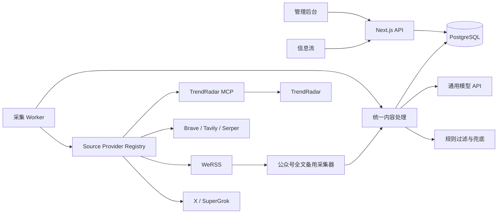
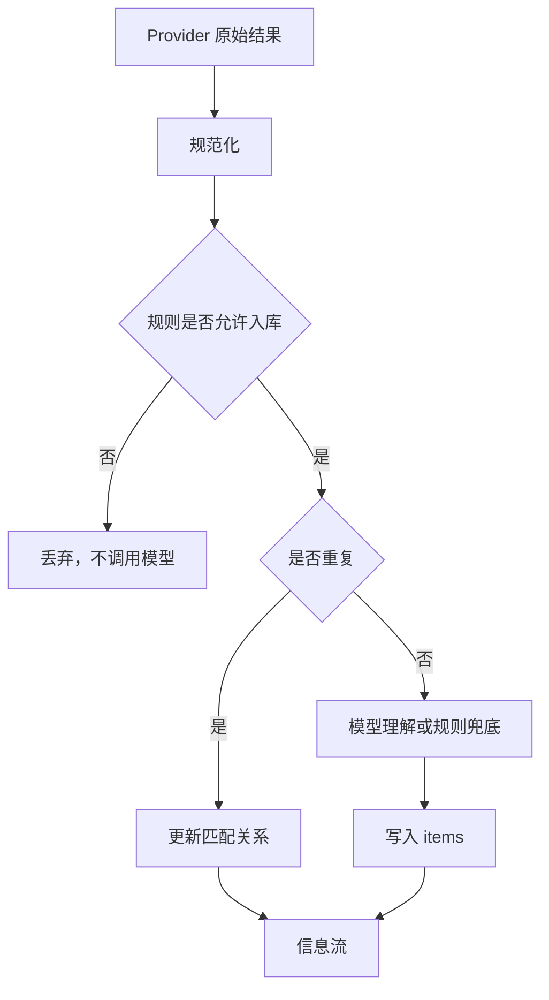

# 见微项目手册

> 文档版本：0.1  
> 更新日期：2026-07-20  
> 当前状态：私有项目，未开放源代码许可

## 1. 项目概览

见微是一套面向个人或小团队的智能信息台。它把分散在 X / Twitter、微信公众号、全网搜索、榜单和 RSS 中的公开信息，统一采集、清洗、去重、理解并展示在一条可筛选的信息流中。

产品要解决的不是“再做一个 RSS 阅读器”，而是三件连续的事情：

1. **稳定获得信息**：用户在后台添加账号、公众号、关键词或 RSS 来源，系统按频率自动采集。
2. **把不同来源变成同一种数据**：统一作者、标题、正文、发布时间、来源、链接、标签和处理状态。
3. **降低阅读成本**：通过规则和模型生成中文标题、摘要、内容类型、主题标签、相关性分和推荐理由。

当前产品是单用户、自托管优先的版本，适合个人情报台、行业研究、内容选题和品牌监控。它还不是一个面向公众注册、多租户计费的 SaaS。

## 2. 当前边界

### 2.1 已实现

- X / Twitter 指定公开账号监控。
- SuperGrok / X Search 和 X 官方 API 两种采集方式。
- 微信公众号指定账号订阅。
- 已订阅公众号内的关键词筛选。
- Brave Search、Tavily、Serper 三种全网搜索服务。
- TrendRadar 榜单与 RSS 复用。
- 统一信息流、平台筛选、内容类型筛选、主题标签和搜索。
- 收藏、精选、最新、全部信息等阅读视图。
- 模型摘要、中文标题、分类、标签、相关性分和推荐理由。
- 公众号全文多级获取与失败补抓。
- 管理后台账号密码登录、平台凭据管理、内容处理状态和健康检查。
- Docker Compose 本地部署与 Caddy HTTPS 生产部署。

### 2.2 暂未实现

- 多用户、团队空间和精细权限系统。
- 云端托管、订阅计费和用量账单。
- 官方移动端应用。
- 对所有第三方平台的绝对稳定采集保证。
- 自动规避平台风控或突破访问限制。
- 开源许可证和公共贡献流程。

### 2.3 合规边界

见微只用于处理用户有权访问的公开信息。微信公众号、X 和搜索服务都受各自平台条款、账号状态、接口额度和访问频率限制。系统提供频率控制、预算限制、错峰和失败退避，但不承诺第三方采集永远可用。

## 3. 用户使用流程

### 3.1 首次启动

1. 运行 `./start.sh`。
2. 打开 `http://localhost:3000/admin`。
3. 使用管理员账号密码登录。
4. 在“平台连接”中配置所需凭据。
5. 微信公众号首次使用时，在 WeRSS 后台完成扫码授权。
6. 在“监控任务”中添加来源。
7. 回到信息流等待首次采集和内容理解完成。

### 3.2 添加监控

后台支持四类任务：

| 任务 | 输入 | 数据来源 | 建议频率 |
| --- | --- | --- | --- |
| X / Twitter | 公开账号用户名 | SuperGrok / X Search 或 X 官方 API | SuperGrok 2–3 小时；官方 API 30–60 分钟 |
| 微信公众号 | 任意一篇该公众号文章链接 | WeRSS | 2–3 小时 |
| 公众号关键词 | 关键词、必含词、排除词、目标公众号 | 已入库公众号文章的本地筛选 | 15–30 分钟 |
| 全网关键词 | 查询词、范围、必含词、排除词、域名 | Brave / Tavily / Serper | 1–2 小时，普通追踪可用 2–4 小时 |

保存任务后，系统根据任务内容生成稳定的错峰时间，避免大量同频率任务在同一分钟执行。

### 3.3 阅读信息

信息流支持三组互相独立的筛选维度：

- **来源平台**：X、微信公众号、全网搜索、榜单 / RSS。
- **内容类型**：产品动态、模型发布、行业商业、论文研究、实践教程、政策安全、观点解读。
- **主题标签**：根据内容动态生成，如公司、模型、产品、技术方向或事件主题。

“精选”不是独立来源，而是基于内容相关性、完整度、时效性和可解释推荐结果形成的阅读视图。

## 4. 信息来源与 Provider

所有采集能力都通过统一的 Source Provider Registry 进入系统。

| Provider ID | 平台 | 类型 | 说明 |
| --- | --- | --- | --- |
| `x_grok` | X | 订阅能力 | 使用 SuperGrok / X Search，保存带真实推文引用的结果 |
| `x_official` | X | API | X 官方 API 后备路径 |
| `wechat_werss` | 微信 | 订阅服务 | 解析文章链接、订阅公众号、读取文章列表 |
| `wechat_keyword` | 微信 | 本地规则 | 在已采集的公众号文章中匹配关键词 |
| `web_brave` | 全网搜索 | API | 适合品牌词、公司名和新闻监控 |
| `web_tavily` | 全网搜索 | API | 适合语义研究和更宽的召回 |
| `web_serper` | 全网搜索 | API | 使用 Google 结果面 |
| `trendradar` | 榜单 / RSS | Sidecar | 复用 TrendRadar 的榜单、RSS 与来源配置能力 |

Provider Registry 位于 `src/sources/registry.ts`。新增来源时，应先扩展 Provider，而不是直接在 worker 中增加孤立分支。

## 5. 系统架构



### 5.1 组件职责

| 组件 | 职责 |
| --- | --- |
| `web` | Next.js 信息流、管理后台和 API |
| `worker` | 轮询到期任务、采集、入库、处理和记录运行状态 |
| `postgres` | 监控任务、内容、匹配关系、用量、健康状态和加密凭据 |
| `migrate` | 启动前执行 Drizzle 数据库迁移和连接器种子 |
| `werss` | 微信公众号订阅和文章列表 |
| `wechat-fallback` | 可选的公众号全文增强采集器 |
| `trendradar` | 榜单、RSS 和其自身的采集配置 |
| `trendradar-mcp` | 将 TrendRadar 内容通过 MCP 提供给见微 |
| `trendradar-refresh` | 后台保存来源后触发一次 TrendRadar 刷新 |
| `caddy` | 生产环境唯一公网入口和 HTTPS 终止 |

### 5.2 复用原则

TrendRadar 以独立 Docker / MCP sidecar 运行。见微不复制它的 GPL 源码，只保存归一化后的内容和匹配关系。详细决策见 [TrendRadar 集成架构](architecture-trendradar.md)。

## 6. 数据处理链路

一条新内容进入系统时，会依次经过以下阶段：

1. **采集**：Provider 返回统一的 `NormalizedItem`。
2. **规范化**：统一 URL、作者、标题、正文、发布时间、图片和来源字段。
3. **规则过滤**：在调用模型前应用来源规则、必含词、排除词、领域兴趣和基础质量判断。
4. **去重**：按 `platform + upstreamId`、`canonicalUrl`、`contentHash` 三层判断。
5. **模型理解**：需要时生成中文标题、摘要、类型、主题标签、相关性分和推荐理由。
6. **持久化**：写入 `items`，并通过 `item_matches` 记录是哪一个监控任务命中。
7. **展示**：信息流根据来源、类型、主题、收藏和搜索条件查询。



规则过滤在模型前执行，目的是避免明显无关内容消耗模型费用。模型失败时，规则可以提供基础分类和标签，但不会伪装成“模型处理成功”，也不会展示空泛的推荐理由。

## 7. AI 内容理解

### 7.1 一个模型入口，多种内容能力

“模型 API”是统一能力入口，不只服务公众号。启用后，新进入的 X、全网搜索、榜单 / RSS 内容都可以使用它生成：

- 中文显示标题或忠实中文推文。
- 1–2 句中文摘要。
- 单一内容类型。
- 多个动态主题标签。
- 0–100 相关性分。
- 基于具体内容事实的推荐理由。

公众号全文理解需要单独开启，因为它可能触发逐篇全文抓取，耗时和成本明显高于使用已有摘要。

### 7.2 通用接口

系统通过 OpenAI Chat Completions 兼容接口接入模型，支持 DeepSeek、火山方舟、OpenAI-compatible 服务以及其他实现相同协议的提供商。后台可根据 Base URL 和 API Key 检测 `/models`，再选择可用模型。

### 7.3 持久化状态

每条内容保存独立的模型处理状态：

- `pending`：等待处理。
- `success`：摘要、分类、标签、标题和推荐信息完整。
- `partial`：模型返回了部分有效结果。
- `failed`：调用失败，并记录错误码与错误信息。
- `skipped`：规则决定跳过。
- `disabled`：模型能力未启用。

失败内容可以从后台小批量补跑，避免一次把大量历史内容全部送入模型。

## 8. 公众号全文链路

公众号采集分为“订阅文章列表”和“获取文章全文”两个问题：

1. WeRSS 负责识别公众号、订阅账号和返回文章列表。
2. 如果文章列表中已有可用正文，直接进入内容处理。
3. 如果正文缺失，系统按配置尝试公开文章直连。
4. 仍然失败时，可调用 `wechat-download-api` 兼容的增强采集器。
5. 失败原因、来源和最后抓取时间写入数据库，后台支持补抓。

这条链路不能保证每篇文章都成功。登录状态、文章权限、微信风控、页面结构变化和第三方项目状态都可能影响结果。

## 9. 调度、错峰与失败处理

可选采集频率分为：

- 高频更新：10、15、20、30、45 分钟。
- 常规监控：1、1.5、2、3、4、5、6 小时。
- 低频巡检：8、12、24 小时。

调度逻辑位于 `src/lib/monitor-schedule.ts`：

- 新任务根据稳定哈希分散首次执行时间。
- 后续执行保持固定偏移，不让同频率任务集中触发。
- 暂时性错误进入短周期错峰重试。
- 连续失败达到阈值后可自动停用。
- X / SuperGrok 另有每日软预算；X 官方 API 和全网搜索可记录用量与估算费用。

## 10. 数据模型

| 表 | 用途 |
| --- | --- |
| `connectors` | 平台连接器及健康状态 |
| `connector_credentials` | 连接器加密凭据 |
| `monitors` | 用户监控任务、配置、游标、频率和错误状态 |
| `items` | 统一内容及模型处理结果 |
| `item_matches` | 内容与监控任务的多对多命中关系 |
| `bookmarks` | 单用户收藏 |
| `collection_runs` | 每次采集的数量、状态、模型处理和错误信息 |
| `usage_ledger` | API、模型请求和估算成本 |
| `runtime_health` | worker 等运行时心跳 |
| `api_credentials` | 后台保存的加密平台密钥和管理配置 |

数据库结构以 `src/db/schema.ts` 为准，迁移文件位于 `drizzle/`。

## 11. Web 页面与 API

### 11.1 页面

| 路径 | 用途 |
| --- | --- |
| `/` | 精选信息流 |
| `/?view=latest` | 最新信息 |
| `/?platform=...` | 按来源平台查看 |
| `/?type=...` | 按内容类型查看 |
| `/?topic=...` | 按主题标签查看 |
| `/starred` | 收藏 |
| `/admin` | 监控任务 |
| `/admin/connectors` | 平台连接、模型、来源和处理状态 |

### 11.2 API

| API | 用途 |
| --- | --- |
| `/api/auth/login`、`/logout`、`/password` | 后台登录、退出和修改密码 |
| `/api/monitors`、`/api/monitors/[id]` | 监控任务 CRUD |
| `/api/monitors/validate` | 来源验证和预览 |
| `/api/settings/credentials` | 平台 API 凭据 |
| `/api/settings/summary` | 模型配置 |
| `/api/settings/summary/models` | 检测可用模型 |
| `/api/settings/summary/backfill` | 内容理解补跑 |
| `/api/settings/wechat-content` | 公众号全文链路配置和补抓 |
| `/api/settings/trendradar-sources` | 榜单和 RSS 来源 |
| `/api/settings/trendradar-interests` | 领域兴趣和排除规则 |
| `/api/settings/xai-oauth` | SuperGrok / xAI 授权状态 |
| `/api/bookmarks` | 收藏状态 |
| `/api/health` | Web、数据库和 worker 健康状态 |

写操作使用后台登录会话或 Bearer API Token 鉴权。

## 12. 目录结构

```text
information-monitor/
├── docs/                    # 架构、部署、审计、计划和项目手册
├── drizzle/                 # PostgreSQL 迁移与快照
├── infra/                   # Caddy、TrendRadar 配置和刷新服务
├── public/                  # 静态资源
├── scripts/                 # 数据质量修复和维护脚本
├── src/
│   ├── app/                 # Next.js 页面和 Route Handlers
│   ├── components/          # 信息流与后台界面组件
│   ├── connectors/          # 平台采集实现
│   ├── db/                  # Schema、查询、迁移种子
│   ├── ingestion/           # 规范化、去重和入库
│   ├── lib/                 # 调度、模型、标签、健康和内容策略
│   ├── sources/             # 统一 Provider Registry
│   └── worker/              # 常驻采集进程
├── tests/                   # Vitest 单元与工作流测试
├── docker-compose.yml       # 本地 / OrbStack 部署
├── docker-compose.prod.yml  # 公网服务器部署
├── Dockerfile
└── start.sh                 # 一键启动与诊断
```

## 13. 配置原则

### 13.1 环境变量

`.env.example` 是本地模板，`.env.production.example` 是生产模板。真实 `.env` 永远不进入 Git。

配置主要分为：

- 数据库和加密：`DATABASE_URL`、`APP_ENCRYPTION_KEY`。
- 后台鉴权：`ADMIN_USERNAME`、`ADMIN_PASSWORD`、`ADMIN_API_TOKEN`。
- 平台连接：X、搜索、WeRSS、TrendRadar、xAI。
- 模型：Provider、Base URL、API Key、模型名、并发、RPM、输入上限和成本。
- Worker：轮询、超时、失败阈值和心跳。
- 公众号全文：直连开关、备用采集器和补抓批次。

完整字段、默认值和说明以两个 example 文件为准。

### 13.2 后台保存的凭据

平台密钥可以从管理后台写入数据库，保存后 worker 下一轮刷新，无需修改 YAML 或重启。

- `APP_ENCRYPTION_KEY` 用于 AES-256-GCM 静态加密。
- 浏览器只读取“是否已配置”，不会取回密钥明文。
- 管理员新密码使用 scrypt 加盐哈希。
- 浏览器 Cookie 只保存签名会话值，不保存原密码或 API Token。

`APP_ENCRYPTION_KEY` 丢失后，数据库中的已有加密凭据无法恢复，必须重新填写。

## 14. 部署

### 14.1 本机或 OrbStack

```bash
./start.sh
```

也可以直接运行：

```bash
docker compose up -d --build
```

### 14.2 公网服务器

使用 `docker-compose.prod.yml`，只将 Caddy 的 80/443 暴露到公网。PostgreSQL、WeRSS、TrendRadar、MCP 和刷新服务只留在 Docker 内网。

完整流程见 [线上部署说明](production-deploy.md)。

### 14.3 数据持久化

关键数据位于具名 Docker volumes：

- PostgreSQL 数据。
- WeRSS 数据和登录状态。
- 公众号备用采集器数据。
- TrendRadar 输出。
- Caddy 证书与配置。

升级容器前应先执行数据库备份，并保存 `.env` 和 `APP_ENCRYPTION_KEY`。

## 15. 安全模型

当前系统按“单用户、最小公网暴露”设计：

- 阅读页默认公开，管理页和写 API 受保护。
- 人使用账号密码；程序使用独立 API Token。
- 管理密码可以在后台修改，其他旧会话立即失效。
- API Key 加密后入库。
- 生产环境只暴露 Caddy。
- 容器不挂载 Docker Socket。
- `.env`、数据库文件、构建产物和本地缓存均由 `.gitignore` 排除。

生产部署仍需由使用者负责：

- 强密码和 HTTPS。
- 防火墙与服务器更新。
- 第三方 API Key 的最小权限和定期轮换。
- 数据备份、恢复演练和日志保留。
- 对采集内容的合规使用。

## 16. 健康检查与故障排查

### 16.1 常用命令

```bash
./start.sh status
./start.sh doctor
./start.sh logs
docker compose ps
docker compose logs -f worker
docker compose logs -f web
curl http://localhost:3000/api/health
```

### 16.2 常见问题定位

| 现象 | 优先检查 |
| --- | --- |
| 信息流没有更新 | worker 心跳、任务 `nextRunAt`、最近一次 `collection_runs` |
| X 采集失败 | Provider 选择、SuperGrok 授权、官方 API Token、每日预算 |
| 公众号没有新文章 | WeRSS 登录状态、订阅是否存在、文章列表接口 |
| 公众号没有摘要 | 全文状态、模型开关、模型 API 配置、处理积压 |
| 全网搜索无结果 | Provider API Key、必含词和排除词、域名限制 |
| 榜单出现无关内容 | TrendRadar 来源、兴趣规则、规则是否在模型前命中 |
| 大量任务同时失败 | 第三方限流、任务频率、错峰和重试批次 |
| 后台无法登录 | 管理账号、密码覆盖状态、Cookie 和系统时间 |

## 17. 开发与质量门槛

```bash
pnpm install
pnpm dev
pnpm lint
pnpm test
pnpm build
docker compose config
```

提交前最低要求：

1. ESLint 通过。
2. Vitest 全量测试通过。
3. Next.js 生产构建通过。
4. `git diff --check` 无空白错误。
5. `.env`、真实 Token、数据库和用户内容没有进入 Git。
6. 涉及部署时，验证 `/api/health` 和实际容器状态。

## 18. 第三方依赖与升级风险

| 依赖 | 作用 | 主要风险 |
| --- | --- | --- |
| Next.js / React | Web 应用 | 大版本升级带来框架行为变化 |
| PostgreSQL / Drizzle | 持久化 | Schema 迁移和备份兼容 |
| WeRSS | 公众号订阅 | 微信登录失效、接口和风控变化 |
| wechat-download-api | 公众号全文备用 | 登录状态、页面结构和项目维护状态 |
| TrendRadar | 榜单 / RSS | 上游配置格式、MCP 契约和许可证边界 |
| X / xAI | 推文来源 | 额度、搜索质量、接口政策 |
| 搜索 Provider | 全网搜索 | 价格、额度、结果语义差异 |
| 模型 Provider | 内容理解 | 成本、速率限制、结构化输出稳定性 |

第三方声明见根目录 `THIRD_PARTY_NOTICES.md`。

## 19. 未来开源准备

当前仓库保持私有，根目录没有 `LICENSE`，因此不授予复制、修改或再分发权。决定开源前至少完成以下事项：

- [ ] 选择并添加明确的开源许可证。
- [ ] 核对所有第三方组件、镜像、图标和示例内容的许可证兼容性。
- [ ] 清理 Git 历史中的真实凭据、用户内容、内部域名和个人数据。
- [ ] 将旧代号和部署专用变量统一整理。
- [ ] 增加 `SECURITY.md`、`CONTRIBUTING.md`、行为准则和 Issue 模板。
- [ ] 建立 GitHub Actions：lint、test、build、secret scan 和镜像构建。
- [ ] 提供不含真实数据的演示种子、截图和最小配置。
- [ ] 记录数据库迁移兼容策略和版本升级路径。
- [ ] 明确微信公众号、X 和搜索采集的使用条款与责任边界。
- [ ] 将实验性 `docs/plans/` 与正式文档分层。
- [ ] 发布前执行一次独立安全审计和全新机器安装测试。

在完成许可证和历史清理之前，不应把仓库直接切换为 Public。

## 20. 文档索引

- [README：快速上手](../README.md)
- [项目手册：完整产品与技术说明](project-handbook.md)
- [生产部署](production-deploy.md)
- [TrendRadar 集成架构](architecture-trendradar.md)
- [第三方声明](../THIRD_PARTY_NOTICES.md)
- `docs/plans/`：历史设计与实施计划，仅用于追踪决策，不代表所有内容仍是当前行为。

## 21. 版本定位

当前私有首版按 `v0.1.0` 管理，目标是：

- 单用户自托管可以持续运行。
- 四类来源形成完整采集闭环。
- 模型处理状态可见、可解释、可补跑。
- Docker 部署、备份和升级路径清楚。
- 为未来替换 Provider、扩展标签和开放源码保留稳定边界。

功能行为以代码、数据库迁移和测试为最终依据；当本手册与实现不一致时，应在同一次提交中修正文档。
